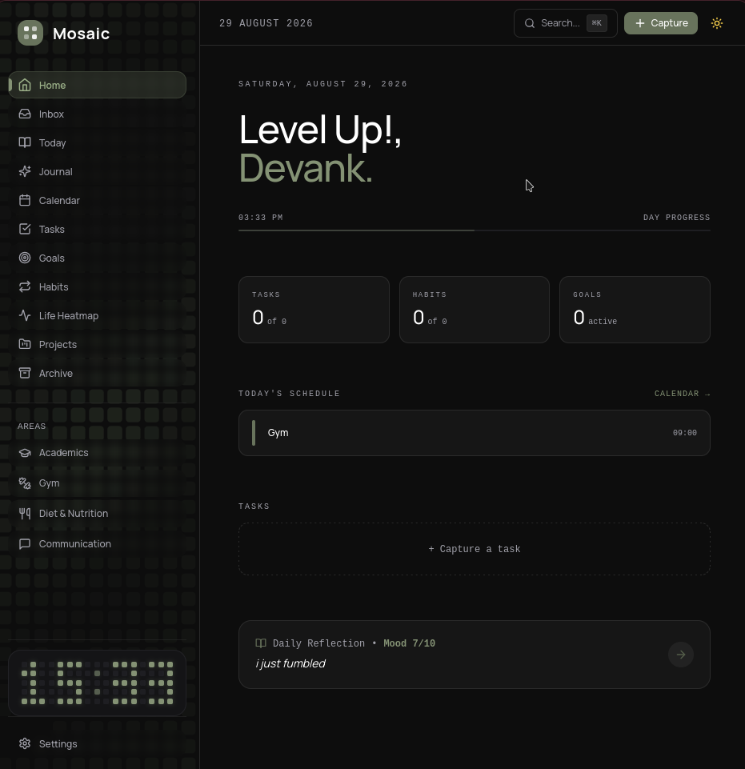
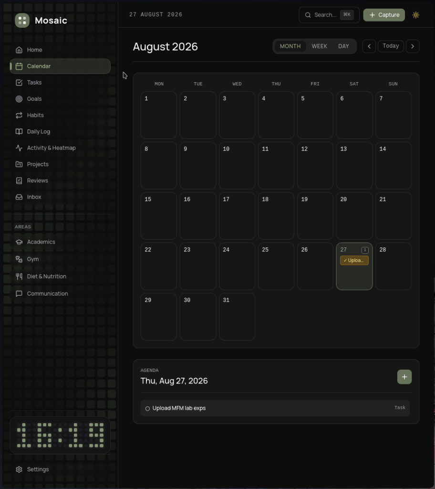
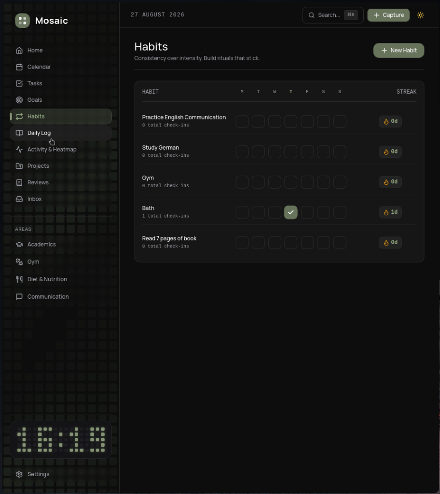
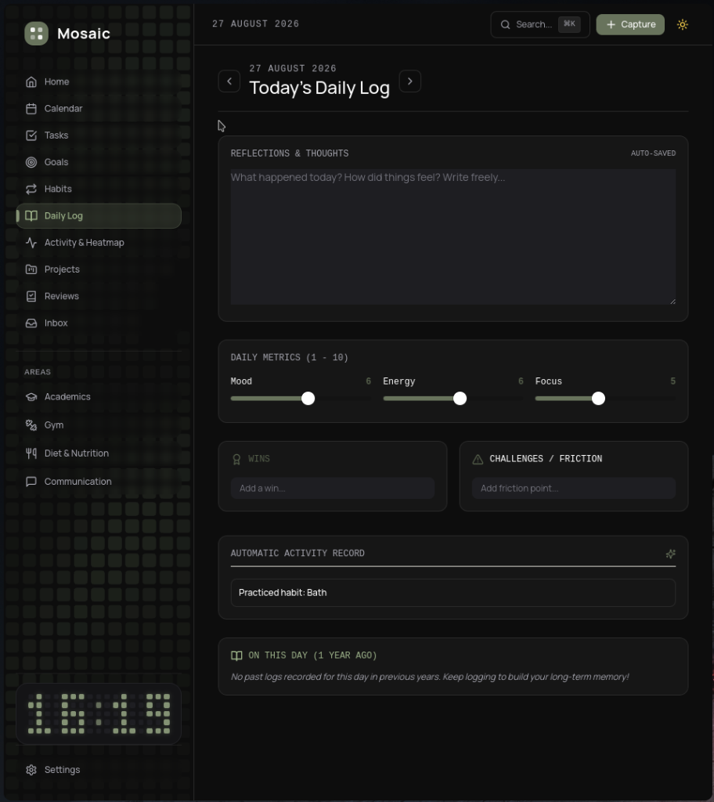
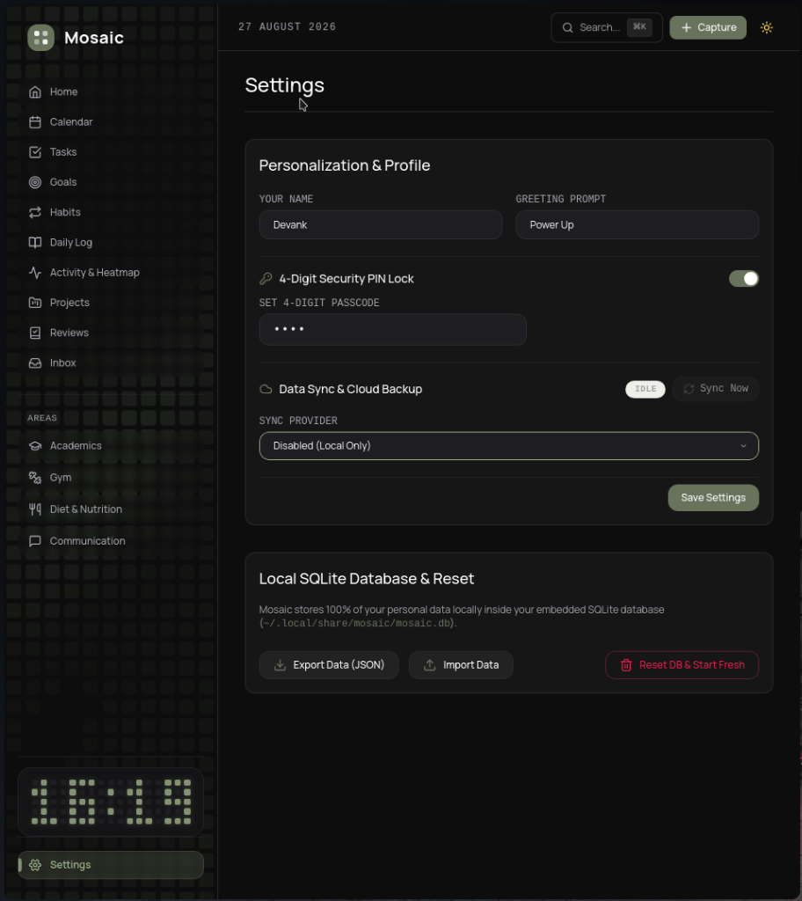

# Mosaic

> A minimalist, local-first Personal Life OS built for daily focus, tracking, and reflection.


---

## Screenshots

| Home Dashboard | Calendar View |
| :---: | :---: |
|  |  |

| Habit Tracker | Daily Log & Reflection |
| :---: | :---: |
|  |  |

| Settings & Security |
| :---: |
|  |

---

## Overview

**Mosaic** consolidates your daily schedule, habits, goals, reflections, and specialized life tracking into one unified, offline-first dashboard. All data stays 100% local in your browser.

---

## Core Features

- 🌅 **Editorial Dashboard** — Live clock, waking-day progress bar, daily snapshots, and schedule overview.
- 📋 **Task Manager** — Priority levels, due dates/times, subtasks, recurrence rules, and celebratory SFX.
- 🗓️ **Calendar** — Month, week, and day views for events, tasks, and deadlines.
- 🔁 **Habit Tracker** — Daily check-ins, streak tracking, and completion history.
- 🎯 **Multi-Tier Goals** — Cascading goal horizons (`Long-term` down to `Daily`) with visual progress.
- 📓 **Daily Log** — Journal notes, Mood/Energy/Focus ratings, Wins & Obstacles lists, and On This Day lookbacks.
- 🟩 **Activity Heatmap** — 365-day activity contribution grid, filterable by life area.
- 🔄 **Periodic Reviews** — Weekly & monthly reflection logs with auto-computed metrics.
- ⚡ **Quick Capture** — Universal shortcut (`Cmd/Ctrl + K`) to capture thoughts or tasks instantly.

---

## Life Areas

Specialized modules for tracking key domains:

- 🎓 **Academics** — Course catalog, target GPA calculator, attendance counters, assignment deadlines, exam countdowns, and study timer.
- 🏋️ **Gym & Fitness** — Mon–Sun muscle group split planner, exercise database, workout session logger, and weight/body fat tracking.
- 🥗 **Diet & Nutrition** — Meal logging, calorie/macro breakdown (Protein/Carbs/Fats), and daily hydration tracking.
- 💬 **Communication** — Contact directory with relationship context, last interaction timestamps, and follow-up reminders.

---

## Privacy, Security & Synchronization

- **100% Local-First** — Data is stored locally in your browser's storage by default.
- **Real-time Multi-Device Sync** — Instant bidirectional streaming across devices using WebSockets or REST API endpoints.
- **Standalone Sync Server Included** — Run your own sync server locally or on the cloud (`node server/sync-server.js`).
- **Passcode Lock** — Optional 4-digit PIN security lock screen.
- **JSON Export / Import** — 1-click workspace backup and restore via Settings.

---

## Tech Stack

- **Frontend**: React 18, TypeScript 5, Vite 5
- **Styling**: Tailwind CSS 3
- **State & Storage**: Zustand 4 (Persist middleware with `localStorage`)
- **Icons**: Lucide React

---

## Getting Started

```bash
# Clone the repository
git clone https://github.com/notdevank/Mosaic.git
cd Mosaic

# Install dependencies
npm install

# Start development server
npm run dev
```

Open `http://localhost:3000` in your browser.

---

## License

[MIT](LICENSE)
