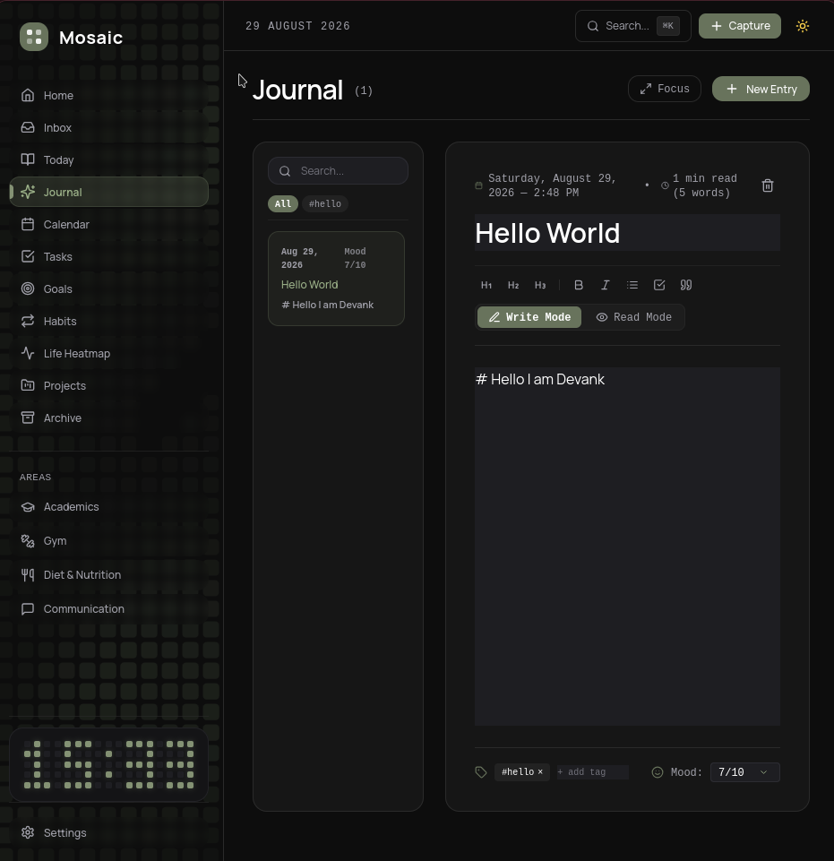
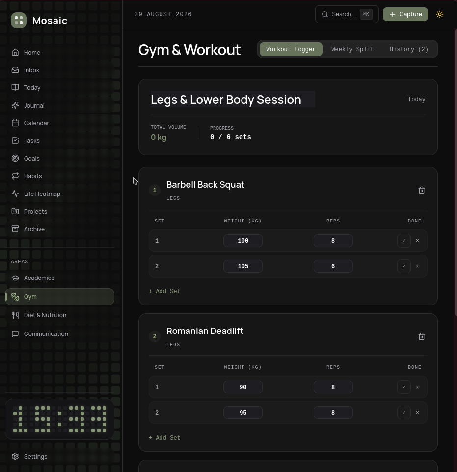
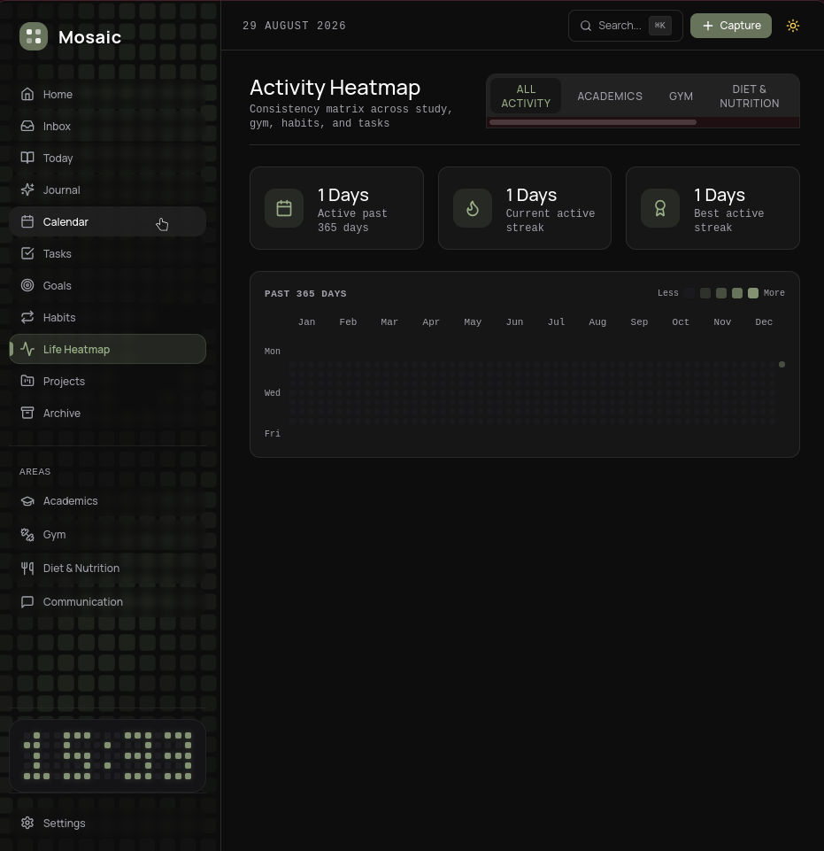

# Mosaic

> A quiet, local-first Personal Life OS built for daily focus, tracking, and reflection.


---

## Screenshots

| Home Dashboard | Journal & Markdown Studio |
| :---: | :---: |
|  |  |

| Calendar View | Gym & Workout Studio |
| :---: | :---: |
|  |  |

| Activity Heatmap |
| :---: |
|  |

---

## Overview

**Mosaic** consolidates daily planning, task execution, habit building, structured journaling, and specialized domain tracking into a unified local workspace. Designed with a quiet, tactile editorial aesthetic, all user data stays 100% local on your device.

---

## Architecture & Storage

- **100% Local-First**: Built with zero mandatory cloud dependencies.
- **Desktop Storage**: SQLite engine (`sqlite:mosaic.db`) via Tauri v2 desktop runtime.
- **Web & PWA Storage**: Reactive state persistence with IndexedDB and `localStorage`.
- **Backup & Restore**: 1-click JSON snapshot export and import via Settings.
- **Passcode Protection**: Optional 4-digit PIN lock screen.

---

## Core Features

- 🌅 **Editorial Dashboard** — Live clock, waking-day progress indicator, customizable greeting, agenda preview, and daily reflection card.
- 📓 **Journal Studio** — Write and Read mode tabs with real-time Markdown rendering (headings, bold, italics, task lists, blockquotes), reading time calculator, and mood tracking.
- 🏋️ **Gym & Workout Studio** — Real-time workout logger with set completion checklists, weight (kg) and rep inputs, volume calculation, and a customizable 7-day Weekly Split table with custom focus notes.
- 📋 **Task Management** — Priority tags, due dates, subtasks, and quick task capture.
- 🗓️ **Calendar & Agenda** — Interactive month, week, and day views mapping tasks, events, and deadlines.
- 🔁 **Habit Tracking** — Daily check-ins, streak calculations, and completion history.
- 🟩 **Activity Heatmap** — 365-day contribution matrix tracking habits, study, workouts, and tasks.
- 📥 **Inbox & Quick Capture** — Instant thought capture space (`Inbox`) to dump unprocessed ideas and convert them to tasks later.

---

## Life Modules

- 🎓 **Academics** — Course catalog, target GPA calculator, attendance counters, assignment deadlines, and study session timer.
- 🏋️ **Gym & Fitness** — Workout logger, volume metrics, and customizable weekly training split schedule.
- 🥗 **Diet & Nutrition** — Daily meal logging, macro distribution (Protein, Carbs, Fats), and hydration tracking.
- 💬 **Communication** — Contact directory with relationship notes and follow-up reminders.

---

## Cross-Platform Binaries

Mosaic builds natively for desktop and web via Tauri v2 and GitHub Actions:

- **macOS**: Universal Binary (`.dmg`, `.app`) for Apple Silicon and Intel.
- **Windows**: 64-bit NSIS Setup (`.exe`) and `.msi` installers.
- **Linux**: `.AppImage` and Debian `.deb` packages.
- **Web App**: Production-optimized PWA bundle.

---

## Download & Installation

For regular users, download the pre-compiled installer for your operating system:

| Platform | Download | Format |
| :--- | :--- | :--- |
| 🍏 **macOS** | [Download Universal `.dmg`](https://github.com/notdevank/Mosaic/releases/latest) | Apple Silicon & Intel Universal |
| 🪟 **Windows** | [Download `.exe` Installer](https://github.com/notdevank/Mosaic/releases/latest) | 64-bit Installer |
| 🐧 **Linux** | [Download `.AppImage` / `.deb`](https://github.com/notdevank/Mosaic/releases/latest) | AppImage & Debian Package |

---

## Tech Stack

- **Frontend**: React 18, TypeScript 5, Vite 5
- **Desktop Runtime**: Tauri v2, Rust
- **Styling**: Tailwind CSS 3 (Warm monochrome palette with sage green accents)
- **State Management**: Zustand 4
- **Icons**: Lucide React

---

## Development Setup (For Contributors)

If you wish to build from source or contribute to Mosaic:

```bash
# Clone the repository
git clone https://github.com/notdevank/Mosaic.git
cd Mosaic

# Install dependencies
npm install

# Start web development server
npm run dev

# Start Tauri desktop application
npm run tauri:dev
```

Open `http://localhost:3000` in your browser.

---

## License

[MIT](LICENSE)
