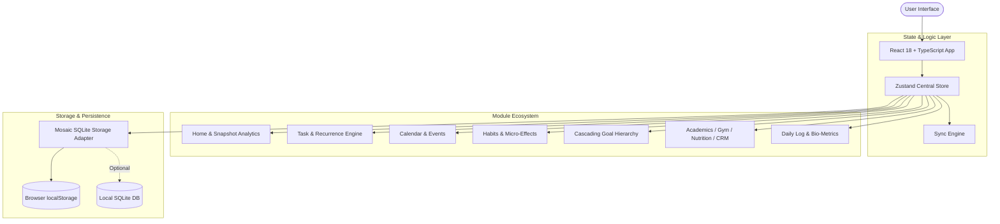

<div align="center">

```
  ███╗   ███╗ ██████╗ ███████╗ █████╗ ██╗ ██████╗ 
  ████╗ ████║██╔═══██╗██╔════╝██╔══██╗██║██╔════╝ 
  ██╔████╔██║██║   ██║███████╗███████║██║██║      
  ██║╚██╔╝██║██║   ██║╚════██║██╔══██║██║██║      
  ██║ ╚═╝ ██║╚██████╔╝███████║██║  ██║██║╚██████╗ 
  ╚═╝     ╚═╝ ╚═════╝ ╚══════╝╚═╝  ╚═╝╚═╝ ╚═════╝ 
```

### **A minimal, local-first Personal Operating System crafted for intentional living.**

*Unify your tasks, habits, goals, calendar, daily reflections, deep work metrics, and life domains into a singular, distraction-free workspace.*

---

[](https://reactjs.org/)
[](https://www.typescriptlang.org/)
[](https://tailwindcss.com/)
[](https://vitejs.dev/)
[](https://github.com/pmndrs/zustand)
[](#-privacy--data-sovereignty)
[](LICENSE)

[Key Features](#-key-features) • [Specialized Life Areas](#-specialized-life-areas) • [Architecture](#-system-architecture) • [Quick Start](#-quick-start) • [Roadmap](#-roadmap)

</div>

---

> [!NOTE]
> **Why Mosaic?** Traditional productivity apps fragment your mental space across isolated silos—one app for tasks, another for habits, a third for workout logs, and a fourth for journaling. **Mosaic** integrates all of them into a unified, editorial-grade dashboard with zero backend latency and 100% offline data sovereignty.

---

## ⚡ The Mosaic Philosophy

```
  Traditional Stack               The Mosaic Way
┌────────────────────┐         ┌─────────────────────────────────────────┐
│ Task App (Cloud)   │         │                                         │
├────────────────────┤         │             M O S A I C                 │
│ Habit Tracker      │         │                                         │
├────────────────────┤   ───►  │  ┌───────────┐ ┌───────────┐ ┌───────┐  │
│ Workout Logger     │         │  │ Tasks &   │ │ Habits &  │ │ Life  │  │
├────────────────────┤         │  │ Calendar  │ │ Analytics │ │ Areas │  │
│ Journal & Notes    │         │  └───────────┘ └───────────┘ └───────┘  │
└────────────────────┘         │    100% Local • Zero Cloud • Instant    │
                               └─────────────────────────────────────────┘
```

- **📖 Editorial Typography**: Clean serif headers, muted sage accents (`#68735C`), and warm paper background tokens designed to reduce cognitive friction.
- **🔒 Local-First Sovereignty**: Your data never leaves your device. State is persisted in browser storage and local SQLite databases.
- **⌨️ Universal Keyboard Ergonomics**: Quick capture and global search powered by universal hotkeys (`Cmd/Ctrl + K`).
- **🎯 Multi-Scale Cascading**: Connect micro daily actions to macro life goals with visual progress bars.

---

## ✨ Key Features

<details open>
<summary><b>🌅 1. Editorial Morning Dashboard</b></summary>
<br />

- **Waking-Day Progress Bar**: Live visual meter computing day completion percentage based on waking hours (6:00 AM – 12:00 AM).
- **Time-Aware Greeting & Dateline**: Adapts greeting dynamically (`Good Morning`, `Good Afternoon`, `Good Evening`, `Late Night`) with mono-spaced date formatting.
- **Snapshot Analytics**: Instant KPI tiles displaying task completion ratios, habit streaks, and active goal counts.
</details>

<details open>
<summary><b>📋 2. Task Management & Recurrence Engine</b></summary>
<br />

- **Priority Triaging**: Assign `High`, `Medium`, or `Low` priority tags with optional due dates and times.
- **Checkable Subtasks**: Break complex deliverables into micro-steps with instant progress updates.
- **Flexible Recurrence**: Configure tasks to repeat daily, on weekdays, weekly, biweekly, monthly, or custom intervals.
- **Cross-Domain Linking**: Tag tasks with specific **Goals**, **Projects**, or **Life Areas**.
</details>

<details open>
<summary><b>🎯 3. Multi-Tiered Cascading Goals</b></summary>
<br />

- **5-Tier Goal Hierarchy**: Organize life direction into `Long-term`, `Yearly`, `Monthly`, `Weekly`, and `Daily` horizons.
- **Progress Tracking**: Automatic progress calculation (0–100%) as linked milestones and tasks are completed.
</details>

<details open>
<summary><b>🔁 4. Habit Tracking & Audio-Visual Feedback</b></summary>
<br />

- **Streak Grid**: Monitor completion history across customizable target frequencies.
- **Sensory Feedback**: Built-in subtle completion audio and ambient pixel grid particle animations upon completing tasks or habits.
</details>

<details open>
<summary><b>📓 5. Daily Reflection & Bio-Metrics</b></summary>
<br />

- **Daily Bio-Scores**: Log daily self-assessments for `Mood` (1–10), `Energy` (1–10), and `Focus` (1–10).
- **Structured Journaling**: Capture Wins, Obstacles, and Tomorrow's Intention in dedicated log entries.
- **Manual Timeline**: Chronologically record events, sessions, or thoughts throughout the day.
</details>

<details open>
<summary><b>🟩 6. GitHub-Style Activity Heatmap</b></summary>
<br />

- **Productivity Matrix**: Visual contribution map tracking total daily output across deep work, study sessions, workouts, and habit practice.
</details>

<details open>
<summary><b>🏗️ 7. Project Workspaces & Milestones</b></summary>
<br />

- **Phase Management**: Track projects through `Planning`, `Active`, `Paused`, and `Completed` stages.
- **Milestone Tracking**: Define key project checkpoints with individual completion toggles.
</details>

<details open>
<summary><b>🔄 8. Periodic Weekly & Monthly Reviews</b></summary>
<br />

- **Reflection Audits**: Guided review templates to evaluate completed tasks, study hours, habit adherence, wins, and areas for improvement.
</details>

---

## 🎓 Specialized Life Areas

Mosaic goes beyond generic task lists by providing dedicated, domain-specific sub-applications:

| Icon | Life Area | Deep Feature Set |
| :---: | :--- | :--- |
| 🎓 | **Academics** | Course catalog, Target vs Actual GPA calculator, Attendance tracker, Assignment deadlines, Exam countdowns, and a integrated Study Session timer. |
| 🏋️ | **Gym & Fitness** | Exercise database, Mon–Sun muscle group split planner, Workout logger (sets, reps, weight), Personal Record (PR) tracking. |
| 🥗 | **Diet & Nutrition** | Meal logging (Breakfast, Lunch, Dinner, Snack), calorie counter, macronutrient ratios (Protein, Carbs, Fats), and daily hydration counter. |
| 💬 | **Personal CRM** | Contact manager with relationship context, last interaction timestamps, follow-up alerts, and meeting/conversation logs. |
| 🎨 | **Custom Areas** | Build bespoke spaces tailored to your hobbies, business, or creative pursuits with custom icons and color schemes. |

---

## 📐 System Architecture



---

## ⌨️ Universal Shortcuts

| Shortcut | Action |
| :--- | :--- |
| `Cmd` / `Ctrl` + `K` | Open Universal Quick Capture / Global Search |
| `Esc` | Close active modal or lock screen |
| `Tab` / `Shift + Tab` | Navigate form inputs and modal fields |

---

## 🔒 Privacy & Data Sovereignty

- **Zero Remote Dependency**: All database operations occur locally inside your client environment.
- **PIN Lock Shield**: Protect your daily reflections and private metrics with an optional passcode screen on application launch.
- **1-Click Data Portability**: Export your entire Life OS workspace to raw JSON format or restore backups anytime via Settings.

```json
{
  "userSettings": { "theme": "dark", "accentColor": "#68735C" },
  "tasks": [...],
  "habits": [...],
  "goals": [...],
  "dailyLogs": { ... }
}
```

---

## 🚀 Quick Start

### Prerequisites
- **Node.js**: `≥ 18.0.0`
- **npm**: `≥ 9.0.0`

### Installation

```bash
# 1. Clone the repository
git clone https://github.com/devank-hub/Mosaic.git

# 2. Navigate to project root
cd Mosaic

# 3. Install dependencies
npm install

# 4. Launch development server
npm run dev
```

The application will start at `http://localhost:3000`.

### Production Build

To create an optimized production build for static web deployment:

```bash
npm run build
```

The distribution bundle will be output to the `dist/` directory, ready to deploy to **Vercel**, **Netlify**, **GitHub Pages**, or any static host.

---

## 📂 Repository Structure

```
Mosaic/
├── src/
│   ├── components/
│   │   ├── areas/          # Academics, Gym, Nutrition, CRM & Custom Views
│   │   ├── common/         # Modals (Quick Capture, Global Search, PIN Lock)
│   │   ├── gym/            # Weekly Split & Exercise Loggers
│   │   ├── layout/         # Header, Sidebar, BottomNav
│   │   └── views/          # Main Views (Home, Tasks, Goals, Habits, Heatmap)
│   ├── db/                 # Local Storage & SQLite Adapter
│   ├── services/           # Data Sync Engine & Backup Utilities
│   ├── store/              # Zustand State Store & Initial Seed Data
│   ├── types/              # Full TypeScript Interfaces
│   └── utils/              # Sound SFX, Confetti & Date Utilities
├── public/                 # Favicon & Static Assets
├── index.html              # HTML Entrypoint
├── tailwind.config.cjs     # Tailwind Design System Configuration
├── vite.config.ts          # Vite Bundler Settings
└── package.json            # Project Manifest & Scripts
```

---

## 🗺️ Roadmap & Vision

- [x] **Core Life OS Engine** (Tasks, Habits, Goals, Calendar, Daily Log)
- [x] **Specialized Life Areas** (Academics, Fitness, Nutrition, CRM)
- [x] **PIN Security Lock & Local Data Persistence**
- [x] **Activity Heatmap & Completion Audio/Visual FX**
- [ ] **PWA (Progressive Web App) Offline Package**
- [ ] **WebDAV / Encrypted Cloud Backup Sync**
- [ ] **Interactive Markdown Notes Editor Integration**
- [ ] **Exportable Weekly PDF Performance Reports**

---

## 🤝 Contributing

Contributions, feedback, and feature proposals are always welcome!

1. Fork the Project
2. Create your Feature Branch (`git checkout -b feature/AmazingFeature`)
3. Commit your Changes (`git commit -m 'Add some AmazingFeature'`)
4. Push to the Branch (`git push origin feature/AmazingFeature`)
5. Open a Pull Request

---

## 📄 License

This project is licensed under the **MIT License** - see the [LICENSE](LICENSE) file for details.

---

<div align="center">

**Built with intention.**  
*If you find Mosaic useful, consider giving the repository a ⭐️!*

</div>
